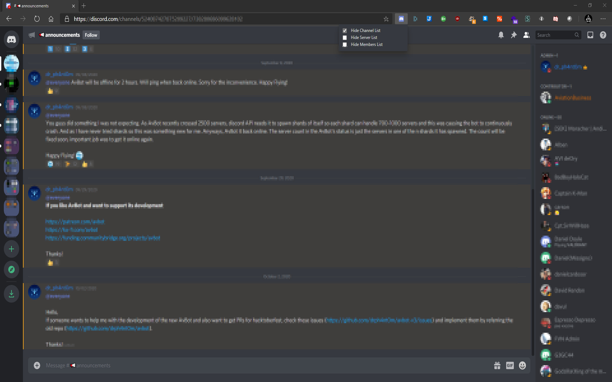

<h1 align="center">Discord Enhancer</h1>

If you like to keep discord open while working on other stuff, this extension will allow you to hide the server list, channel list and member list for the discord.com website. This will allow to keep the window as small as possible without loosing the main message part of the website.

## Screenshots

## Contributing
Pull requests are welcome. For major changes, please open an issue first to discuss what you would like to change.